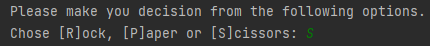
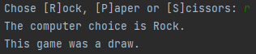
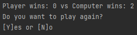

# :video_game: Game "Rock - Paper - Scissors" :video_game:

---
> Description : This is a simple two-player console game, written on Java language.
---
## :beginner: Introduction
In this version of the game "Rock - Paper - Scissors" you play versus the computer (your opponent).
The main purpose of the game is you and your opponent to choose simultaneously on of the options
Rock, Paper or Scissors.

---

## :beginner: Rules
The rules in this game are simple: Rock beats Scissors, Scissors beats Paper and Paper beats Rock.

Image Credits : Google

---

## :beginner: Gameplay
When the game start you will be able to choose from three options displayed on the console.

* Press "R" for Rock
* Press "P" for Paper
* Press "S" for Scissors

Then you will see the computer`s choice and the result of the current game.

On the next line you will see the result of all played games until now and and choice to play the game again.

---

## Algorithm

1. User choice will be taken and stored.
2. The computer will choose a random number from 1 to 9.
    * If computer choose a number from 1 to 33, it will equal to Rock.
    * If computer choose a number from 34 to 66, it will equal to Paper.
    * If computer choose a number from 67 to 99, it will equal to Scissors.
3. The user input will be compared with computer choice.
4. According to rules one of the players will win.
5. The winner will be written on the console.
6. Player choice for new game will be taken.

---

## :beginner: Live Demo

[Link to live demo](https://replit.com/@Stavr1/GameRockPaperScissorsByStavr1?v=1)